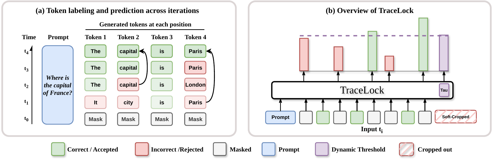

# TraceLock

TraceLock learns a token-level acceptance policy for Dream-style masked diffusion generation. It does not train a new language model. Dream proposes tokens, and TraceLock decides which currently masked positions should be locked for the remaining refinement steps.

This release contains the minimal Dream path used for the math and coding experiments:

1. Generate Dream training traces from GSM8K, Alpaca-Cleaned, and KodCode-HumanEval-like prompts.
2. Train the TraceLock acceptance policy on projected Dream hidden-state traces.
3. Evaluate random, native confidence, native entropy, Fast-dLM, and TraceLock on GSM8K and HumanEval.

Learning-to-PD/L2P, listeners, self-training, reinforcement learning, and ablation-only utilities are intentionally excluded from this open-source path.

## Method Overview

TraceLock is a lightweight controller for frozen diffusion language models: it learns from completed traces whether a proposed token already matches its final trace value, then uses hidden-state features to decide which active tokens to lock during decoding.



## Too Long; Didn't Read

Pick a large external workspace, run setup, generate traces, train, then evaluate:

```bash
export TRACELOCK_HOME=/path/to/tracelock_workspace

bash TraceLock/setup.sh --workspace "$TRACELOCK_HOME" --download-assets
source "$TRACELOCK_HOME/env.sh"

bash TraceLock/scripts/generate_training_traces.sh \
  --num-samples 7000 \
  --devices cuda:0 cuda:1 cuda:2 cuda:3 cuda:4 cuda:5 cuda:6 cuda:7

bash TraceLock/scripts/train.sh \
  --run-name tracelock-dream-math-code-7000 \
  --max-steps 36000

export TRACELOCK_CHECKPOINT_DIR="$TRACELOCK_HOME/checkpoints/tracelock-dream-math-code-7000"
bash TraceLock/scripts/eval_code.sh --run-name humaneval-full-7000 --gpus cuda:0 cuda:1 cuda:2 cuda:3 cuda:4 cuda:5 cuda:6 cuda:7
bash TraceLock/scripts/eval_math.sh --run-name gsm8k-full-7000 --gpus cuda:0 cuda:1 cuda:2 cuda:3 cuda:4 cuda:5 cuda:6 cuda:7
```

No manual `conda activate` is needed. The scripts call `$TRACELOCK_HOME/conda/tracelock/bin/python` directly.

Use a workspace with at least **350 GB free** for the 7000-trace reproduction. We observed about **245 GB** for the generated trace directory, plus about **37 GB** for Conda, Dream, Qwen judge weights, datasets, and checkpoints. More space is needed if you increase `--num-samples`; the trace generator has a conservative 600 GB run-dir cap.

## Reproduced Results

The following numbers are from the 7000-trace run above with Dream-v0-Instruct-7B, Qwen2.5-7B-Instruct as the GSM8K judge, and 8x NVIDIA A40 GPUs.

### HumanEval

| method |     pass@1 | average steps |
|---|-----------:|--------------:|
| random |     0.2256 |        256.00 |
| native-confidence |     0.4878 |        256.00 |
| native-entropy |     0.5488 |        256.00 |
| fast-dLM-th0.9 |     0.4878 |        134.71 |
| TraceLock | **0.5671** |     **83.05** |

### GSM8K

| method |        acc | average steps |
|---|-----------:|--------------:|
| random |     0.4215 |        256.00 |
| native-confidence |     0.5000 |        256.00 |
| native-entropy |     0.6585 |        256.00 |
| fast-dLM-th0.9 |     0.4962 |        140.07 |
| TraceLock | **0.8223** |    **116.14** |

## Workspace Layout

Choose one external workspace. Do not store traces in the git checkout.

```bash
export TRACELOCK_HOME=/path/to/tracelock_workspace
```

`setup.sh` creates this layout:

```text
$TRACELOCK_HOME/
  conda/        # conda env, about 7 GB in our run
  hf_cache/     # Hugging Face cache, including the Qwen judge model
  models/       # Dream checkpoint, about 15 GB
  datasets/     # optional local dataset materialization
  checkpoints/  # projection autoencoder and trained TraceLock policy
  traces/       # generated training traces, about 245 GB for 7000 prompts
  runs/         # eval configs and outputs
  logs/
```

## Setup

From the parent directory containing `TraceLock/`:

```bash
bash TraceLock/setup.sh --workspace "$TRACELOCK_HOME" --download-assets
source "$TRACELOCK_HOME/env.sh"
```

Setup creates the Conda environment and downloads:

| asset | source |
|---|---|
| Dream | `Dream-org/Dream-v0-Instruct-7B` |
| GSM8K | `openai/gsm8k` |
| Alpaca-Cleaned | `yahma/alpaca-cleaned` |
| HumanEval | `openai/openai_humaneval` |
| cleaned KodCode | `BOB12311/kodcode-humaneval-like` |
| Dream activation projection autoencoder | `BOB12311/tracelock-dream-ae` |
| GSM8K judge model | `Qwen/Qwen2.5-7B-Instruct` |

We only provide the projection autoencoder checkpoint and the cleaned KodCode dataset. Dream, GSM8K, Alpaca-Cleaned, HumanEval, and Qwen are downloaded from their original Hugging Face repositories.

## Pipeline

### 1. Generate Training Traces

```bash
bash TraceLock/scripts/generate_training_traces.sh \
  --num-samples 7000 \
  --devices cuda:0 cuda:1 cuda:2 cuda:3 cuda:4 cuda:5 cuda:6 cuda:7
```

This does the following:

- Loads Dream from `$TRACELOCK_HOME/models/dream-v0-instruct-7b`.
- Mixes prompts from GSM8K, Alpaca-Cleaned, and cleaned KodCode-HumanEval-like.
- Runs Dream generation with entropy proposal scoring.
- Captures hidden-state traces, state labels, token-shift-aligned proposal features, and confidence features.
- Projects hidden states through the provided Dream activation autoencoder.
- Writes training/validation sample links under `$TRACELOCK_HOME/traces/dream_math_code/samples`.

Default output:

```text
$TRACELOCK_HOME/traces/dream_math_code/
```

Use `--run-dir` if you want a different trace directory.

### 2. Train TraceLock

```bash
bash TraceLock/scripts/train.sh \
  --run-name tracelock-dream-math-code-7000 \
  --max-steps 36000
```

Default inputs and outputs:

```text
input:  $TRACELOCK_HOME/traces/dream_math_code/samples
output: $TRACELOCK_HOME/checkpoints/tracelock-dream-math-code-7000/
```

The eval scripts use:

```text
$TRACELOCK_CHECKPOINT_DIR/best_rollout_proxy_f0_5.pt
$TRACELOCK_CHECKPOINT_DIR/config.json
```

### 3. Evaluate

Set the checkpoint path if you used the run name above:

```bash
export TRACELOCK_CHECKPOINT_DIR="$TRACELOCK_HOME/checkpoints/tracelock-dream-math-code-7000"
```

Run code evaluation:

```bash
bash TraceLock/scripts/eval_code.sh \
  --run-name humaneval-full-7000 \
  --gpus cuda:0 cuda:1 cuda:2 cuda:3 cuda:4 cuda:5 cuda:6 cuda:7
```

Run math evaluation:

```bash
bash TraceLock/scripts/eval_math.sh \
  --run-name gsm8k-full-7000 \
  --gpus cuda:0 cuda:1 cuda:2 cuda:3 cuda:4 cuda:5 cuda:6 cuda:7
```

Outputs:

```text
$TRACELOCK_HOME/runs/eval/humaneval-full-7000/summary.json
$TRACELOCK_HOME/runs/eval/gsm8k-full-7000/summary.json
```

To run a small smoke test:

```bash
bash TraceLock/scripts/generate_training_traces.sh --num-samples 8 --devices cuda:0
bash TraceLock/scripts/train.sh --max-steps 20
bash TraceLock/scripts/eval_code.sh --num-samples 8 --gpus cuda:0
bash TraceLock/scripts/eval_math.sh --num-samples 8 --gpus cuda:0
```

To evaluate only selected methods:

```bash
bash TraceLock/scripts/eval_code.sh --sets native-entropy tracelock --gpus cuda:0
bash TraceLock/scripts/eval_math.sh --sets native-entropy tracelock --gpus cuda:0
```

If you rerun an evaluation with the same `--run-name`, existing per-sample results are reused because `overwrite` is false in the public configs. This is useful for incremental evaluation.

## Storage Notes

Observed disk usage for the 7000-trace reproduction:

| path | observed size |
|---|---:|
| Conda env | 6.9 GB |
| Dream model | 15 GB |
| Qwen judge model cache | 15 GB |
| HF datasets cache | 0.4 GB |
| projection autoencoder | 0.2 GB |
| trained TraceLock checkpoint | 0.2 GB |
| generated traces | 245 GB |
| eval outputs | less than 1 GB |

Recommended free space:

- **350 GB** for the default 7000-trace reproduction.
- **600 GB+** if you substantially increase `--num-samples`.

## Checkpoint Notes

This release uses TraceLock naming consistently in scripts, configs, logs, and source code. Checkpoints produced by this release write TraceLock config keys such as `d_tracelock` and `d_tracelock_delta`.

The projection autoencoder is not trained by this release path. It is downloaded from Hugging Face and used to project Dream activation traces.
